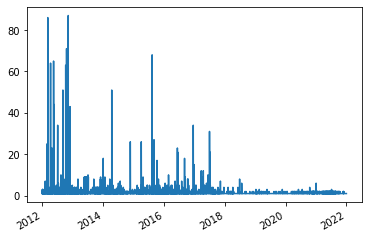
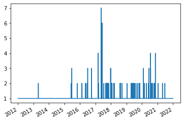
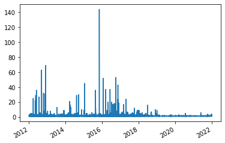
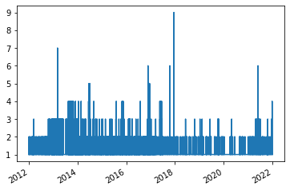
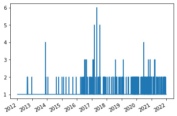
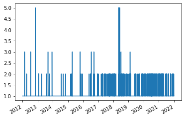
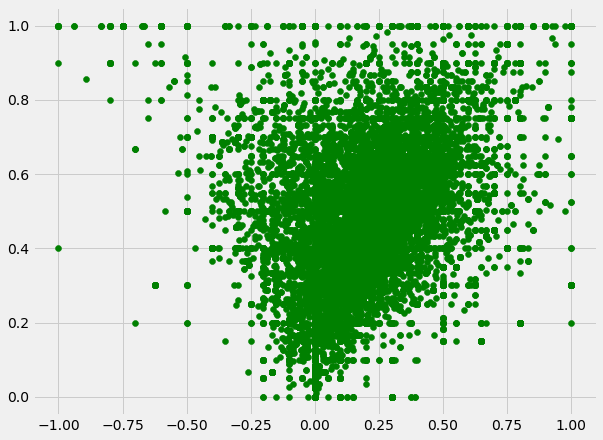
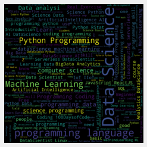

##Programming Over Time##

Throughout the course of this semester, I feel like so many of the skills we used, whether those be through programming or understanding how to analyze the world of the digital humanities, have been incredibly effective for this final project. I came in not even knowing what digital humanities was, and had the bare minimum in coding experience, so to see myself grow to have a personal and working definition, and lots of Python code behind me. My project focused on the changes presented in programming languages over the past decade (2012-2022), utilizing Twitter as the basis of data information I have analyzed. My base for this project really stemmed from the influence presented upon me from the various CS courses I have taken at the UIUC and a want to learn how data science can apply to more things other than academics. I feel like we are not exposed to these types of projects enough in classes, and I would like to develop a better understanding of so many of the growing topics in the ‘real’ world. Later in the semester, once we were exposed to more of these digital humanist blog postings, such as Which DH Tools Are Actually Used in Research and the Pudding articles, I was able to visualize my own final project then and develop an idea of how to go about this. 

Later, once I began to put everything to together, and I took in the feedback from my project proposal I was able to put things together in a way that I had the skill set for. I also liked the way that the Deep-Fried Data article lays out the ground works for gathering data, as in the term “data gardening”. I felt like this was an important aspect I needed to include in my project, and gather data I would be using and that was ultimately the reason Twitter seemed like the best option, especially referring back to Ceglowski’s argument that, “If we take seriously the idea that digitizing collections makes them far more accessible, then we have to accept that the kinds of people and activities those collections will attract may seem odd to us”, (Deep Fried Data). I became one of the people that was able to use this digitalized collection, and like many others in this course to develop something of my own. Now moving into how I determined the best ways to store this data. As someone with limited knowledge outside of the pandas Python library, it was necessary for me to store everything as a data frame and reference back to it using the methods that way. With the sheer number of tweets and data that I scraped from Twitter, I feel like I have been using this data appropriately and not in the way that deems a ‘data lake’ as presented in the “Haunted by Data” blog post by Ceglowski. Again, another article I am glad to have been exposed to prior to developing my own final project. 

Now moving into the blog posts that I mentioned previously, that really allowed me to develop a way to created my project for the specific work I was doing, Which DH Tools Are Actually Used in Research and the Pudding articles really showed me how to create an interactive style, and how to actually narrow down data collection, specifically similarly how it was mentioned here: “stopword list containing tools with names that are also frequent terms” (Barbot). I was also intrigued by Ted Underwood’s piece, Seven ways humanists are using computers to understand text. I was really able to understand more about what I should be on the look out for when identifying ways to analyze data, like when Underwood mentions, “computational analysis of text is not a specific new technology or a subfield of digital humanities; it’s a wide-open conversation in the space between several different disciplines” (Underwood). This got me into sentiment analysis for the Twitter data I had scraped, and do something I had never done. Moving into the process of my final project, I was did have a bumpy start with first Twitter’s API, and later with Twint, but once I was able to use sns.scrapper to create a function that would scrape millions of Tweets over a decade, I was all set. In this markdown file I also included several of the plots I was able to create using matplotlib, a word cloud, and a plot of sentiment analysis to see what Python thought was a positive spectrum tweet, negative, or neutral. I would say that through this project, I have been able to analyze things almost like a digital humanist would. Through the lens of the people, and if the methods I have been using are valid and actually provide proper results in the terms of the work we are doing. I think that I will ultimately continue this project in the future. The plots I have developed have given me insights to how programming have changed, but specifically have shown me results that I was not expecting, such as Java’s decrease, vs Kotlin’s increase in tweets. Data Science and ML have been very hot topics in recent years, even from 2018. The C programming languages have shown to be interesting choice to analyze, as C and C++ have both declined in number of tweets in recent years, but C# has stayed tight, presumably due to the vast functionally it has. In the end I was not able to scrape JavaScript and Python, both ended up showing me an error I was unable to resolve, something I hope to do in the future. I’d like to get more experience using Streamlit, and being able to create my own interactive application to show the skills I have developed during the semester. The current state of the application is quite basic, and not fully functional as the screenshot of the app below suggests. I would also like to expand my scraping to include more languages I had not thought of at the time, namely R, SQL, and Ruby on Rails. 

Overall, I think that this was one of the most interesting projects I have been able to work on at my time at UIUC. 

Java Tweets Plot:

Kotlin Tweets Plot:

C Tweets Plot:

C++ Tweets Plot:

C# Tweets Plot:

Data Science Tweets Plot:

Machine Learning Tweets Plot:

Sentiment Analysis on Data Science Tweets:

Data Science Word Cloud:

